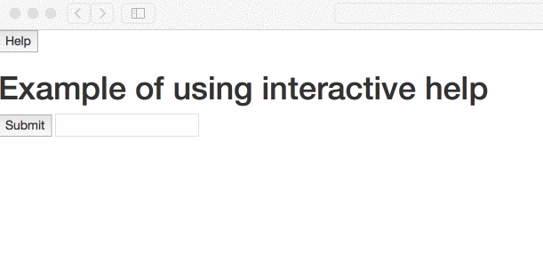

# Interactive help extension

This is a simple script that adds simple bootstrap-popover interactive help to a webpage
When prototyping or developing MVPs I often find myself wanting to priovide documentation that is as close to the user as possible, but would be cheap to include at the same time.

This script allows me to put documentation snippets together with the application code and easily and cheaply expose it to the users of my app.

## How does it look like

When using vanilla bootstrap 3 the exaple looks something like this



## How to use it in the code

In order to use the script, make sure that JQuery and Bootstrap are included in your page

```html
<script src="http://code.jquery.com/jquery-latest.min.js"></script>
<link rel="stylesheet" href="https://maxcdn.bootstrapcdn.com/bootstrap/3.3.7/css/bootstrap.min.css" integrity="sha384-BVYiiSIFeK1dGmJRAkycuHAHRg32OmUcww7on3RYdg4Va+PmSTsz/K68vbdEjh4u" crossorigin="anonymous">
<link rel="stylesheet" href="https://maxcdn.bootstrapcdn.com/bootstrap/3.3.7/css/bootstrap-theme.min.css" integrity="sha384-rHyoN1iRsVXV4nD0JutlnGaslCJuC7uwjduW9SVrLvRYooPp2bWYgmgJQIXwl/Sp" crossorigin="anonymous">
<script src="https://maxcdn.bootstrapcdn.com/bootstrap/3.3.7/js/bootstrap.min.js" integrity="sha384-Tc5IQib027qvyjSMfHjOMaLkfuWVxZxUPnCJA7l2mCWNIpG9mGCD8wGNIcPD7Txa" crossorigin="anonymous"></script>
```

afterward including the script `interactiveHelp.js` should do the trick (for example by using e.g. https://rawgit.com)

All you need to do in you HTML do document elements is to provide at least those fields in the html tag
```
data-help="<order>" data-toggle="popover" data-placement="auto" data-content="<documentation>"
```

and add a class `helpButton` to the control that should initiate the interactive help.

## Example

The [example.html](./example.html) file is a simple usage example.
